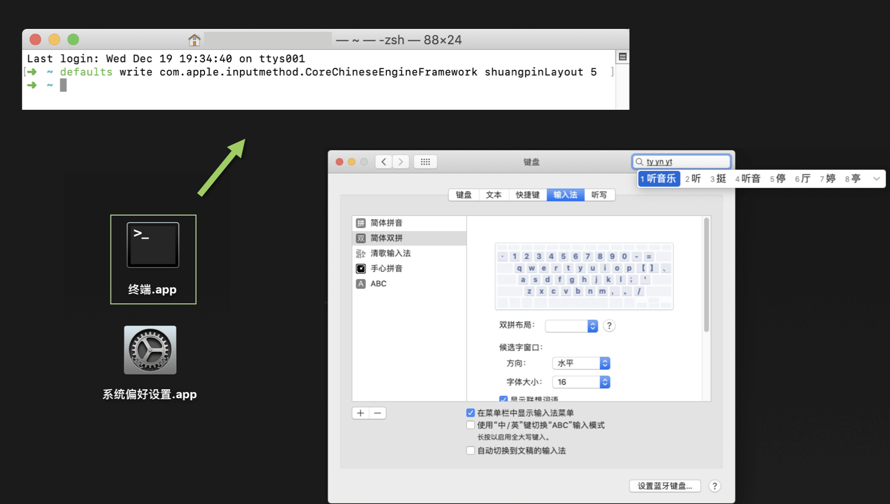
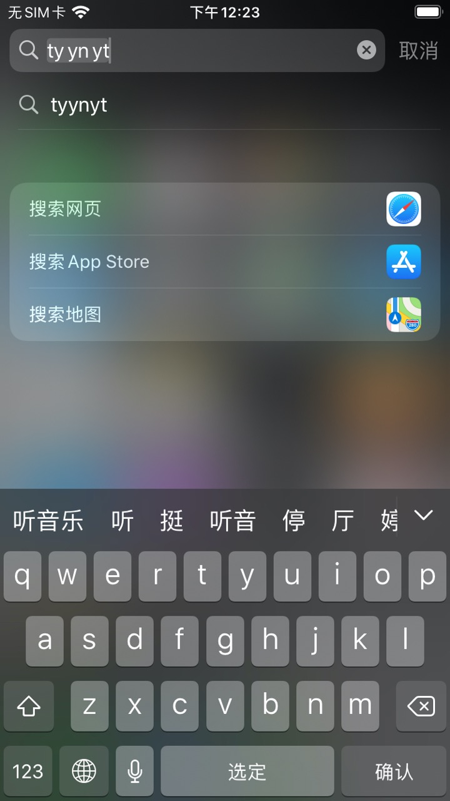

Shuang | 双拼练习
----

v5.10 2020.5.5 更新

### 许可

该工具仅供学习研究使用，不允许用于商业目的

### 开始使用

单字练习：[https://api.ihint.me/shuang](https://api.ihint.me/shuang)

文章练习：[https://api.ihint.me/zi](https://api.ihint.me/zi)

### 功能介绍

1. 支持的双拼方案：

    > 常见【常用输入法内置】：自然码 / 搜狗双拼 / 微软双拼 / 小鹤双拼 / 智能 ABC / 拼音加加 / 紫光双拼
    >
    > 小众【常用输入法几乎不内置】：国标双拼 / 小浪双拼 / 大牛双拼
    >
    > 爱好者【常用输入法不内置】：键道双拼 3 / 键道双拼 6 / 开源小鹳 / 小月双拼 / 韵标块拼

2. 出题模式说明：

    > 全部随机：随机顺序，全部拼音组合
    >
    > 全部顺序：新华字典序，全部拼音组合
    >
    > 困难随机：韵母需转换，全部拼音组合
    >
    > 无拼音：无拼音提示，移除多音字 & 生僻字

3. 按键 & 界面按钮说明：

    > 空格键【Space】 / 回车键【Enter / Return】/ 对错按钮：正确时切换下一个 / 错误时清空输入
    >
    > 退出键【Esc】：清空输入
    >
    > 制表键【Tab】/ 文字题目：显示答案，可能不唯一

4. 输入说明：输入内容只能为字母或半角分号【; 】

5. 多平台适配：

    > 手机上使用：请切换至系统自带英文键盘以获得最佳输入体验，竖屏操作以获得最佳友好界面
    >
    > 电脑上使用：推荐使用 [Chrome 浏览器](https://www.google.cn/chrome)，支持较高版本的 IE （不保证后续更新仍支持）

6. 其他：

    > 支持键位图显示切换
    >
    > 支持夜间模式
    >
    > 支持显示按键提示

### 添加自定义双拼方案

参见其他已有方案自行增加、修改文件即可

### 开发流程

1. 修改 [src/*.js](src) 下的源码，如果有键位图的更新记得更新 [键位图](resources/双拼键位图.xlsx)，并导出到 [img/](img) 下
2. 运行 `npm run debug` 来调试
3. 运行 `npm run build` 来打包
4. 提交代码

### 联系

如果有疑问 / 建议，或发现了错误，请在 Issues 中留言，也可与我邮件联系：[admin@ihint.me](mailto:admin@ihint.me)

更多介绍：[https://sspai.com/post/40185](https://sspai.com/post/40185)

### 键位图

1. [resources/双拼键位图.xlsx](resources/双拼键位图.xlsx) ：可编辑的 Excel 键位图表格

2. [img/*.png](img)：从上述表格中导出的 png 图片

3. 也可在此查看包含 Dvorak 键盘布局的键位图：[https://api.ihint.me/keyboard](https://api.ihint.me/keyboard)

*Web 版键位图如果不能正常显示（如内容排版错乱或重叠），请尝试更新使用最新版 [Chrome 浏览器](https://www.google.cn/chrome)，或换用更高分辨率的屏幕*

### 微信小程序版

可以使用微信扫描下面的二维码，或在微信小程序中搜索 **双拼练习** 即可添加。

关于小程序的更多介绍：[https://sspai.com/post/40624](https://sspai.com/post/40624)

### 在 macOS 设备上使用常见方案的原生双拼

使用 macOS 的用户可以通过在终端中运行以下命令，将原生双拼输入法设置成一些可能未被开放的常见方案

* 以下仅在 macOS 10.13.6 上测试

0. 全拼：`defaults write com.apple.inputmethod.CoreChineseEngineFramework shuangpinLayout 0`

1. 智能 ABC：`defaults write com.apple.inputmethod.CoreChineseEngineFramework shuangpinLayout 1`

2. 微软双拼：`defaults write com.apple.inputmethod.CoreChineseEngineFramework shuangpinLayout 2`

3. 紫光双拼：`defaults write com.apple.inputmethod.CoreChineseEngineFramework shuangpinLayout 3`

4. 小鹤双拼：`defaults write com.apple.inputmethod.CoreChineseEngineFramework shuangpinLayout 4`

5. 自然码：`defaults write com.apple.inputmethod.CoreChineseEngineFramework shuangpinLayout 5`

6. 拼音加加：`defaults write com.apple.inputmethod.CoreChineseEngineFramework shuangpinLayout 6`

7. 搜狗双拼：`defaults write com.apple.inputmethod.CoreChineseEngineFramework shuangpinLayout 7`

### 在 iOS 设备上使用常见方案的原生双拼

* 以下仅在 iOS 13.4.1（越狱） & iOS 13.5（非越狱） 上测试

修改 `/var/mobile/Library/Preferences/com.apple.InputModePreferences.plist` 的 `ShuangpinType` 值即可

具体请阅读 [https://sspai.com/post/60751](https://sspai.com/post/60751)

效果：

外接键盘下同样生效：

